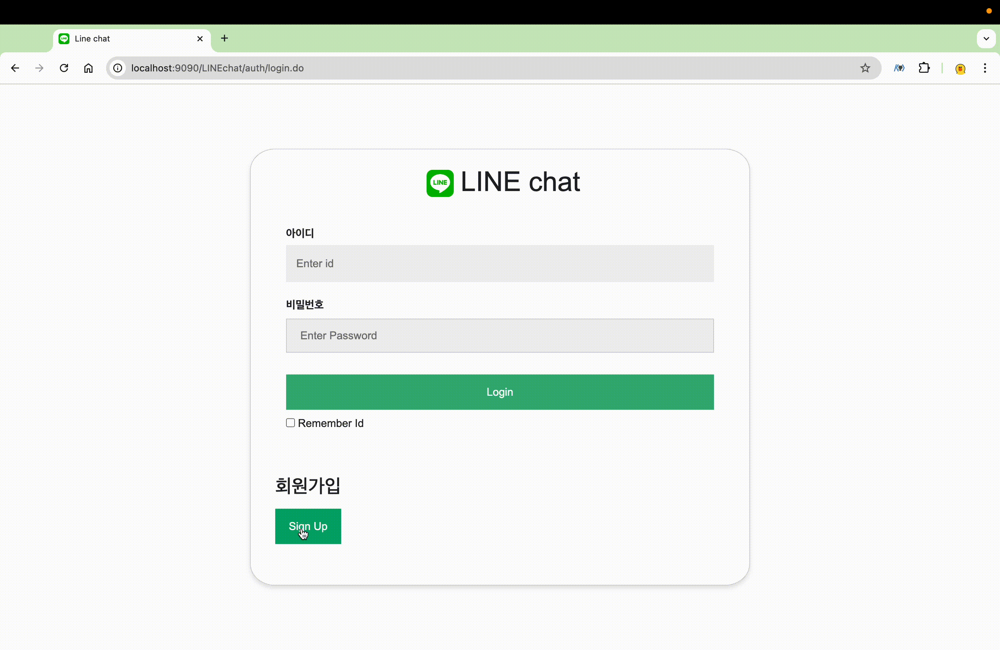

#  LINE chat

web 환경에서 채팅을 즐겨보세요!  
[Project Introduce on PDF](readme/LINEchat.pdf)  
(추천) [Project Introduce in Canva](https://www.canva.com/design/DAGXaH6uNXg/UJNxPnT2V3xvELfrl77VBQ/view?utm_content=DAGXaH6uNXg&utm_campaign=designshare&utm_medium=link&utm_source=editor)

## Authors
<table>
  <tr>
         <td align="center" width="16%">
            <a href="https://github.com/kseenyoung"></a>
            <br />
            <a href="https://github.com/kseenyoung">김신영</a>
        </td>
    </tr>
</table>


## Tech Stack

**Client:** Javascript, HTML, CSS

**Server:** Java, WebSocket, JSP

**Database:** Oracle


## Development Environment


`IDE` Intellij Altimate

`JDK` >= 21

`OS` mac


## Archetecture


## Database


```oracle
drop table if exists rooms;

create table rooms(
    room_id number(10) primary key,
    name varchar(30) not null,
    created_at timestamp default systimestamp not null,
    updated_at timestamp default systimestamp not null
);

create sequence rooms_seq start with 1 increment by 1 maxvalue 10 nocycle nocache;

drop table if exists chats;

create table members(
    member_id varchar2(30) primary key,
    name varchar2(20) not null,
    password varchar2(100) not null,
    created_at timestamp default systimestamp not null,
    updated_at timestamp default systimestamp not null
);

drop table if exists chats;

create table chats(
    chat_id number(20) primary key,
    room_id number(10) constraint chats_roomid_fk references rooms(room_id) ON DELETE CASCADE,
    member_id varchar2(30) constraint chats_memberid references members(member_id) ON DELETE CASCADE,
    content varchar(150) not null,
    created_at timestamp default systimestamp not null,
    updated_at timestamp default systimestamp not null
);

create sequence chats_seq start with 1 increment by 1 maxvalue 9999 nocycle nocache;

select * from all_constraints where table_name = 'chats';

-------------
insert into members(member_id, name, password) values('admin', '관리자', '1234');

insert into rooms(room_id, name) values(rooms_seq.nextval, '드루와');
insert into rooms(room_id, name) values(rooms_seq.nextval, '나랑 대화할 사람');
insert into rooms(room_id, name) values(rooms_seq.nextval, '개발자 모여라');

insert into chats(chat_id, room_id, member_id, content) values(chats_seq.nextval, 1, 'ksy', '나야, 들기름');

commit;

```


## 디렉토리 구조

### src
``` text
src
 ┣ com
 ┃ ┣ shinhan
 ┃ ┃ ┣ auth
 ┃ ┃ ┃ ┣ model
 ┃ ┃ ┃ ┃ ┣ AuthDAO.java
 ┃ ┃ ┃ ┃ ┣ AuthService.java
 ┃ ┃ ┃ ┃ ┗ MemberDTO.java
 ┃ ┃ ┃ ┣ DeleteServlet.java
 ┃ ┃ ┃ ┣ LoginServlet.java
 ┃ ┃ ┃ ┣ SignUpServlet.java
 ┃ ┃ ┃ ┗ UpdateServlet.java
 ┃ ┃ ┣ chat
 ┃ ┃ ┃ ┣ model
 ┃ ┃ ┃ ┃ ┣ ChatDAO.java
 ┃ ┃ ┃ ┃ ┣ ChatDTO.java
 ┃ ┃ ┃ ┃ ┗ ChatServlet.java
 ┃ ┃ ┃ ┣ ChatClient.java
 ┃ ┃ ┃ ┣ ChatService.java
 ┃ ┃ ┃ ┗ WebSocket.java
 ┃ ┃ ┣ config
 ┃ ┃ ┃ ┗ HttpSessionConfigurator.java
 ┃ ┃ ┣ filter
 ┃ ┃ ┃ ┗ AuthFilter.java
 ┃ ┃ ┣ room
 ┃ ┃ ┃ ┣ model
 ┃ ┃ ┃ ┃ ┣ RoomDAO.java
 ┃ ┃ ┃ ┃ ┣ RoomDTO.java
 ┃ ┃ ┃ ┃ ┗ RoomService.java
 ┃ ┃ ┃ ┗ RoomListServlet.java
 ┃ ┃ ┣ util
 ┃ ┃ ┃ ┗ DBUtil.java
 ┃ ┃ ┗ .DS_Store
 ┃ ┗ .DS_Store
 ┗ .DS_Store
```

### web
``` text
web
 ┣ META-INF
 ┃ ┗ context.xml
 ┣ WEB-INF
 ┃ ┣ lib
 ┃ ┃ ┣ lombok.jar
 ┃ ┃ ┣ ojdbc11.jar
 ┃ ┃ ┣ taglibs-standard-compat-1.2.5.jar
 ┃ ┃ ┣ taglibs-standard-impl-1.2.5.jar
 ┃ ┃ ┣ taglibs-standard-jstlel-1.2.5.jar
 ┃ ┃ ┗ taglibs-standard-spec-1.2.5.jar
 ┃ ┗ web.xml
 ┣ auth
 ┃ ┣ css
 ┃ ┃ ┗ home.css
 ┃ ┣ js
 ┃ ┃ ┗ home.js
 ┃ ┣ delete.jsp
 ┃ ┗ home.jsp
 ┣ chat
 ┃ ┣ css
 ┃ ┃ ┗ chat.css
 ┃ ┗ chat.jsp
 ┣ error
 ┃ ┣ error404.jsp
 ┃ ┗ error500.jsp
 ┣ images
 ┃ ┣ line.png
 ┃ ┣ sky.gif
 ┃ ┗ sky.jpg
 ┣ jsp
 ┃ ┗ header.jsp
 ┣ resource
 ┃ ┗ LINEchat.sql
 ┣ room
 ┃ ┣ css
 ┃ ┃ ┗ rooms.css
 ┃ ┗ rooms.jsp
 ┗ .DS_Store
```

## API Reference

### Auth

#### login page

```http
  GET /auth/login.do
```

#### login

```http
  POST /auth/login.do
```

| Parameter | Type     | Description                       |
| :-------- | :------- | :-------------------------------- |
| `member_id` | `string` | **Required**. Id of member |
| `password`  | `string` | **Required**. password of member |

#### signup

```http
  POST /auth/signup.do
```

| Parameter | Type     | Description                       |
| :-------- | :------- | :-------------------------------- |
| `member_id` | `string` | **Required**. Id of member |
| `password`  | `string` | **Required**. password of member |

#### update nickname

```http
  POST /auth/update.do
```

| Parameter | Type     | Description                       |
| :-------- | :------- | :-------------------------------- |
| `modify_name` | `string` | **Required**. nickname for mofification |

#### delete

```http
  POST /auth/delete.do
```

| Parameter | Type     | Description                       |
| :-------- | :------- | :-------------------------------- |
| `password` | `string` | **Required**. password for delete member |


### Room

#### room page

```http
  GET /room/rooms.do
```

### Chat

#### chat page

```http
  GET /chat/chat.do?chatId
```

| Parameter | Type     | Description                       |
| :-------- | :------- | :-------------------------------- |
| `chatId` | `int` | **Required**. chatId for enter chat |

#### webSocket connect

```http
  WebSocket ws://ip:port/LINEchat/websocket?roomId
```

| Parameter | Type     | Description                       |
| :-------- | :------- | :-------------------------------- |
| `roomId` | `int` | **Required**. roomId for enter chat |


## Screenshots

Login<br>

<br>Signup<br>

<br>Modify Nickname<br>

<br>Chatting<br>

<br>Delete member<br>

